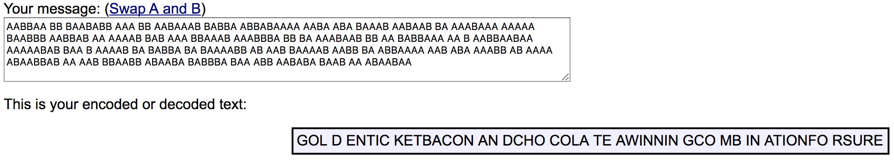

# Down the river we go (Crypto - 200 Points)
## Challenge Courtesy of [Greg Daneault](https://github.com/grdaneault)

> THerES no eARtHly WAY of KNoWINg wHicH DirEcTION THeY ArE gOINg THeREs nO KNOwING WHERE tHEyre ROwiNg OR WHICh wAy THE riVERs FLOwinG is iT RAInINg is IT sNowING IS a HUrrICaNE ABLOWiNg nOT a SPECk oF lIghT iS sHOWIng So THe dANGEr MUst bE GroWING ARe ThE FIRes Of HELL AgLOwiNg IS THe grISly ReAPeR mOwinG yES The DAnGeR mUSt BE GrOWiNG

> Format: GoldenTicket{xxxxxxxx}

Solution
--------

This problem uses the baconian cipher. Since the cipher uses only 'A' or 'B' we know either the captial letters are 'A's or 'B's. In the challenge, the capitals were 'A's. We can then convert the ciphertext to it's A/B binary form.

```
AABBAA BB BAABABB AAA BB AABAAAB BABBA ABBABAAAA AABA ABA BAAAB AABAAB BA AAABAAA AAAAA BAABBB AABBAB AA AAAAB BAB AAA BBAAAB AAABBBA BB BA AAABAAB BB AA BABBAAA AA B AABBAABAA AAAAABAB BAA B AAAAB BA BABBA BA BAAAABB AB AAB BAAAAB AABB BA ABBAAAA AAB ABA AAABB AB AAAA ABAABBAB AA AAB BBAABB ABAABA BABBBA BAA ABB AABABA BAAB AA ABAABAA
```

From here, an online decoder such as [Rumkin](http://rumkin.com/tools/cipher/baconian.php) can be used.



We then get the following:
> GOL D ENTIC KETBACON AN DCHO COLA TE AWINNIN GCO MB IN ATIONFO RSURE

For the last step, the flag needs to be formatted.

Flag: 'GoldenTicket{bacon_and_chocolate_a_winning_combination}'

