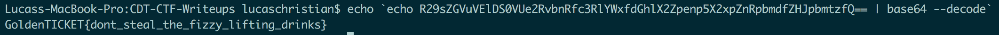

# Factory Basement (Crypto - 50 Points)

> R29sZGVuVElDS0VUe2RvbnRfc3RlYWxfdGhlX2Zpenp5X2xpZnRpbmdfZHJpbmtzfQ==

Solution
--------

By looking at the string one could identify it as base64. Using the commandline, we can use a one-liner to decode it.

```
echo `echo R29sZGVuVElDS0VUe2RvbnRfc3RlYWxfdGhlX2Zpenp5X2xpZnRpbmdfZHJpbmtzfQ== | base64 --decode`
```



Flag: 'GoldenTICKET{dont_steal_the_fizzy_lifting_drinks}'

