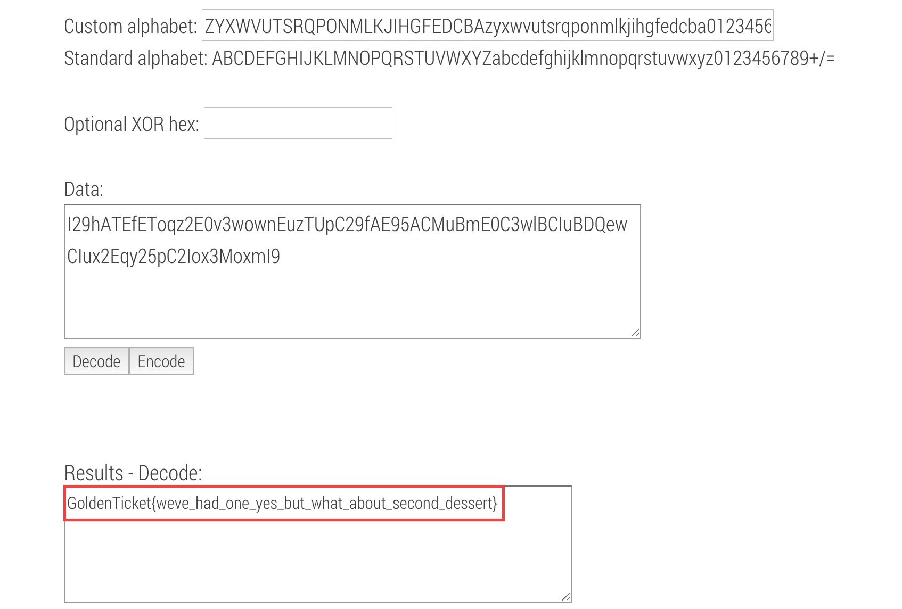

# How can you still be hungry? (Crypto - 300 Points)
## Challenge Courtesy of [Greg Daneault](https://github.com/grdaneault)

> I29hATEfEToqz2E0v3wownEuzTUpC29fAE95ACMuBmE0C3wlBCIuBDQewCIux2Eqy25pC2Iox3MoxmI9
> Format: GoldenTicket{xxxxxxxx}

Solution
--------

This problem asks us if we are hungry still 🤔
If we remember, the flag for "There goes Augustus" was:
> GoldenTICKET{secret_ingredient_1_of_64}

This appears to be think link for satisfying my hunger. As we know Augustus was solved by using the atbash cipher. The flag also appears to a reference to base64.
Taking the standard Base64 alphabet of:
```
ABCDEFGHIJKLMNOPQRSTUVWXYZabcdefghijklmnopqrstuvwxyz0123456789+/=
```

We run it through the atbash cipher, getting the result of:
```
ZYXWVUTSRQPONMLKJIHGFEDCBAzyxwvutsrqponmlkjihgfedcba0123456789+/=
```

From here we need to use this new string as a custom Base64 alphabet for the ciphertext provided.



We then arrive at the flag!

Flag: 'GoldenTicket{weve_had_one_yes_but_what_about_second_dessert}'

