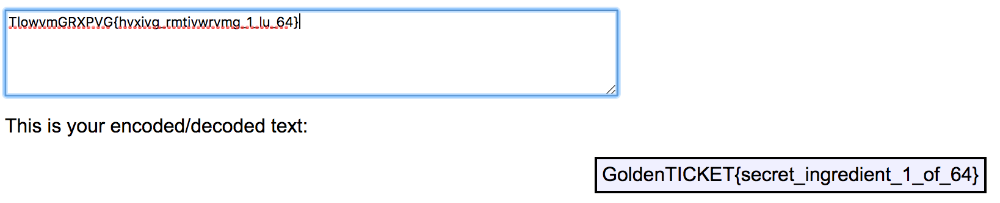

# There goes Augustus (Crypto - 100 Points)

> TlowvmGRXPVG{hvxivg_rmtivwrvmg_1_lu_64}

Solution
--------

This problem uses the atbash cipher. Using an online decoder such as [Rumkin](http://rumkin.com/tools/cipher/atbash.php).

Flag: 'GoldenTICKET{secret_ingredient_1_of_64}'

