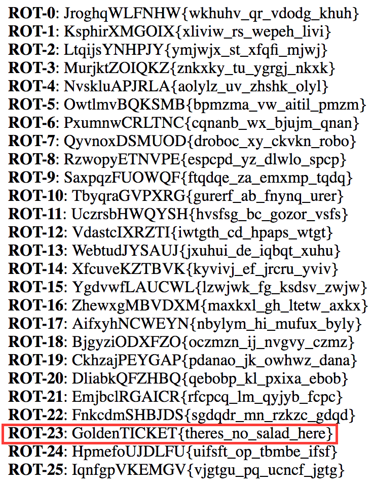

# Looking to diversify? (Crypto - 50 Points)

> JroghqWLFNHW{wkhuhv_qr_vdodg_khuh}

Solution
--------

Looking at the string you can pretty quickly identify that it is a rotation. Using an online tool or a short script you can determine that it is ROT23.

Flag: 'GoldenTICKET{theres_no_salad_here}'

