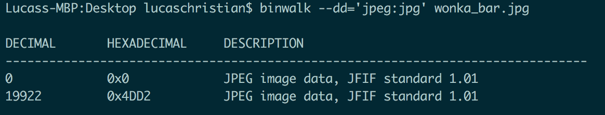
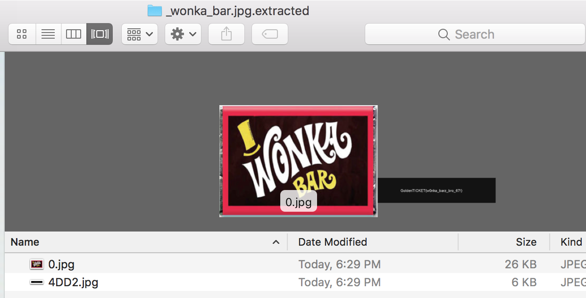

# Wonka Barz (Forensics - 50 Points)

> Find the flag.

Solution
--------

You are given an [image](wonka_bar.jpg) containing a flag. The flag can be recovered by file carving using a tool such a [binwalk](https://github.com/devttys0/binwalk) or alternatively using a hex editor and looking at the structure of the provided jpeg. Essentially, there is a hidden jpeg appended to the image of the Wonka bar.

Using the following command the flag can be carved out:

```
binwalk --dd='jpeg:jpg' wonka_bar.jpg
```


After running the command, binwalk will extra all jpegs present in the file and place them into a directory will all of the extracted elements.



The first element is the image of the Wonka bar while the second element is the hidden flag.


Flag: 'GoldenTICKET{w0nka_barz_bro_67!}'

