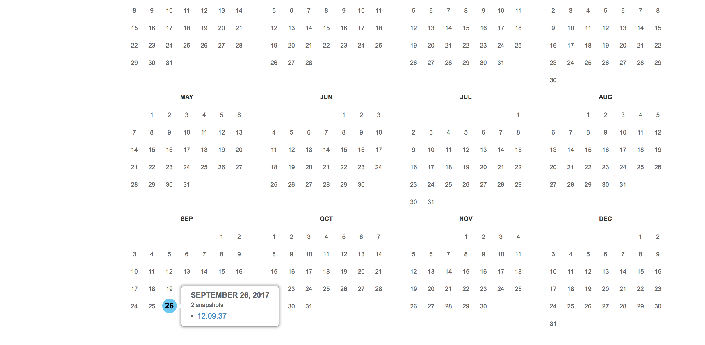
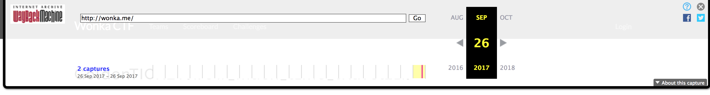
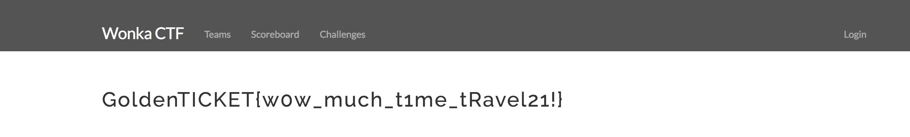

# T1me Traveller (Recon - 200 Points)

> There was a flag on this website....find it.

Solution
--------

This challenge indiciates that there was a flag on the website at one point, but has since been removed. To recover the flag you must use a website archiver such as [Wayback Machine](https://archive.org/web/).

Once the the website has been found you will find 2 snapshots on September 26th. The trick is to not view the default snapshot or else you will see a stock CTFd page, you clicking in the latter part of the day you will find the proper snapshot with the flag hidden behind the Wayback machine banner.

Flag: 'GoldenTICKET{w0w_much_t1me_tRavel21!}'

