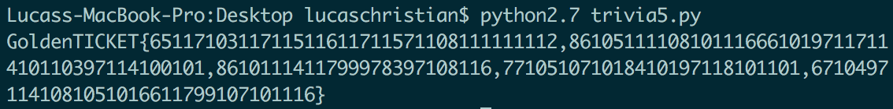

# Trivia 5 (Trivia - 25 Points)

> A comma delimited list of ord(names) of the kids names in order the tickets were found. Omit all spaces.

Solution
--------

```
ticketHolders = "AugustusGloop,VioletBeauregarde,VerucaSalt,MikeTeavee,CharlieBucket"
flagStr = ""


for letter in ticketHolders:
	if letter != ',':
		flagStr += str(ord(letter))
	else:
		flagStr += ','

print("GoldenTICKET{" + flagStr +"}")
```




Flag: 'GoldenTICKET{6511710311711511611711571108111111112,86105111108101116661019711711410110397114100101,8610111411799978397108116,771051071018410197118101101,67104971141081051016611799107101116}'

